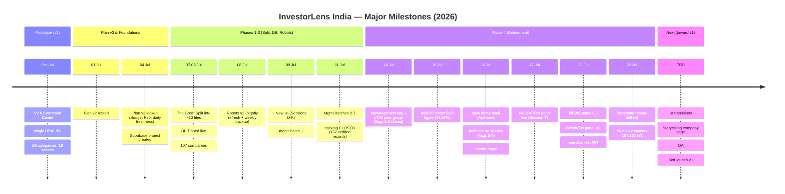
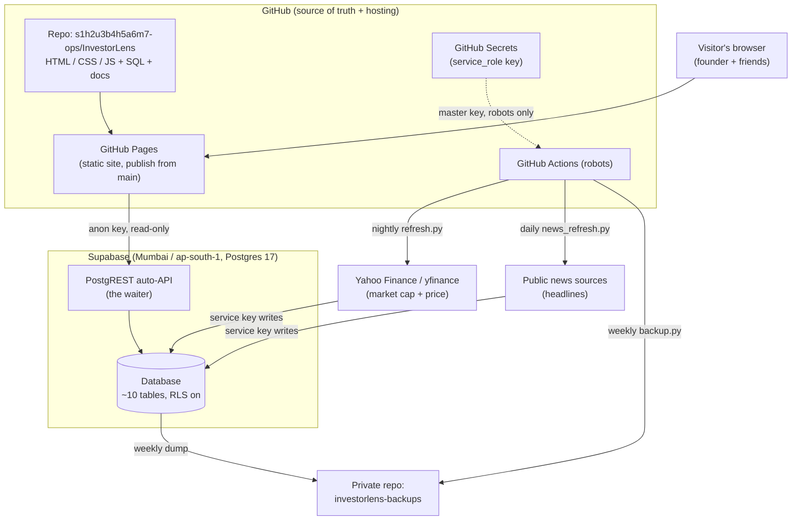
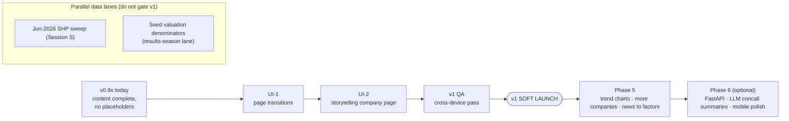
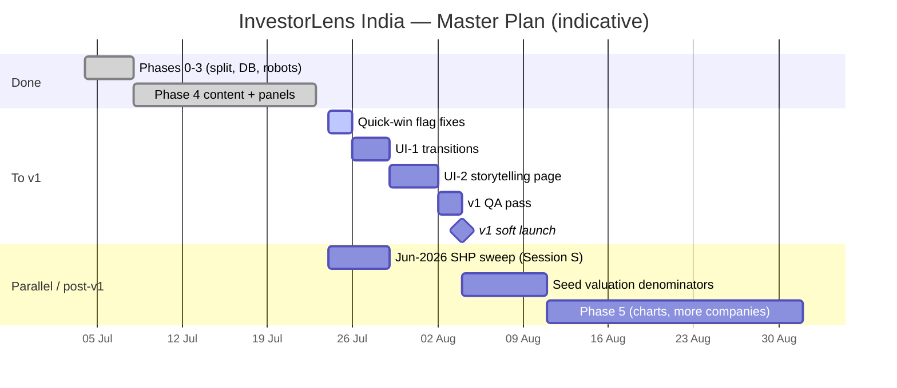

# InvestorLens India — Project Progress Assessment

> **The definitive project encyclopedia and onboarding guide — for humans and AI systems alike.**
> A single living knowledge base for a ₹0-budget, business-first analysis platform covering 107 Indian listed companies.

---

<div align="center">

**PROJECT** · InvestorLens India
**DOCUMENT** · Living Project Knowledge Base & Progress Assessment
**VERSION** · 1.0 · **AS OF** · 23 July 2026
**CODEBASE BASELINE** · `main` @ STATE v5.5 (Session Y) · Live Supabase verified same day
**PREPARED IN THE ROLE OF** · CTO · Principal Architect · Technical Program Manager · Lead Engineer · Documentation Specialist
**AUDIENCE** · The founder, future collaborators, and any future AI assistant taking over development
**REPOSITORY (source of truth for code)** · `s1h2u3b4h5a6m7-ops/InvestorLens`

</div>

---

> **How to read this document.** The repository is the source of truth for code; this document is the source of truth for *understanding*. It never duplicates source or configuration — it references repository paths and explains purpose, responsibilities, dependencies, maturity, and status. Completed work, current work, assumptions, and future plans are labelled distinctly throughout.

---

## Table of Contents

1. [Cover Page](#investorlens-india--project-progress-assessment)
2. [Table of Contents](#table-of-contents)
3. [Executive Summary](#3--executive-summary)
4. [Project Vision, Mission, and Objectives](#4--project-vision-mission-and-objectives)
5. [Project Story](#5--project-story-how-the-project-evolved-and-why)
6. [Chronological Timeline of Major Milestones](#6--chronological-timeline-of-major-milestones)
7. [Summaries of Important Conversations and Decisions](#7--summaries-of-important-conversations-and-decisions)
8. [Architecture Decision Log](#8--architecture-decision-log)
9. [Current System Architecture](#9--current-system-architecture)
10. [Repository Overview and Directory Structure](#10--repository-overview-and-directory-structure)
11. [Important Files and Their Purposes](#11--important-files-and-their-purposes)
12. [Component Documentation](#12--component-documentation)
13. [Development History](#13--development-history)
14. [Feature Matrix](#14--feature-matrix)
15. [Research Log and Findings](#15--research-log-and-findings)
16. [External Sources and References](#16--external-sources-and-references)
17. [Technology Stack](#17--technology-stack-with-reasons)
18. [AI Collaboration Log](#18--ai-collaboration-log)
19. [Problems, Solutions, and Lessons Learned](#19--problems-encountered-solutions-and-lessons-learned)
20. [Current Project Progress Assessment](#20--current-project-progress-assessment)
21. [Security, Performance, Scalability, Testing, Deployment](#21--security-performance-scalability-testing-and-deployment-status)
22. [Updated Roadmap](#22--updated-roadmap)
23. [Immediate Next Tasks](#23--immediate-next-tasks)
24. [Master Development Plan](#24--master-development-plan)
25. [AI Handoff Guide](#25--ai-handoff-guide-for-a-new-ai-developer)
26. [Compact AI Memory Summary](#26--compact-ai-memory-summary)
27. [Quick Start Guide](#27--quick-start-guide)
28. [Documentation Index](#28--documentation-index)
29. [Repository Snapshot and Statistics](#29--repository-snapshot-and-statistics)
30. [Version History and Changelog](#30--version-history-and-changelog)
31. [Final Executive Assessment and Recommendations](#31--final-executive-assessment-and-recommendations)
32. [Appendix](#32--appendix)

---

## 3 · Executive Summary

**InvestorLens India** is a free, public, read-only web platform that helps a person *understand a business* — what it does, where it sits in its value chain, what real-world forces are pushing on it right now, how good its economics are, who runs it, and how the market is talking about it. Valuation is deliberately placed second-to-last. The platform is explicitly **not** a stock-tip machine; its promise is *"understand the business first — the stock price is just one data point about it."* It currently covers **107 Indian listed companies** (the Nifty 100 universe, effectively).

The project is built and run by a **solo, non-technical founder** working only through the **GitHub web editor** and the **Supabase SQL editor** — no terminal, no local development environment. An AI assistant operates as the CTO and engineering team: researching, designing, writing every line of code and SQL, verifying and dry-running everything, and delivering complete paste-ready files. The founder's job is a closed list of four moves: paste, upload, paste-back the result, and look at the live site.

**Where the project stands (23 July 2026).** The hard part is done. The eight-to-ten-table Supabase backend is live and stable; all 107 companies are fully populated with hand-verified content across every section of the company page; and — as of **Session Y, today** — the company page has **zero remaining placeholders**. The final three feature panels (Valuation, News & Sentiment, Growth) and the last content gap (14 value-chain caveats) all shipped between 17–23 July. Two automation robots (nightly market-cap refresh, weekly backup) plus a daily news robot run unattended at ₹0 cost. The project's integrity is guarded by a single canonical **acid-test string** verified word-for-word after every change.

**My independent assessment:** the platform is **~93% of the way to a shippable public v1**, and every remaining item is *finishing*, not *building*. What stands between today and launch is a UI-polish lane (page transitions, then a storytelling company page), a light cross-device QA pass, and a soft launch. Data-freshness maintenance (the quarterly shareholding sweep) and populating live valuation ratios run in parallel and do not gate v1. The most notable honest caveats: the Valuation panel is structurally complete but shows *"awaiting verification"* for every ratio (all denominators are NULL by design until a results-season data lane runs), and a handful of low-severity engineering flags (non-halting migration judges, an unguarded self-test line) are tracked but do not block launch.

**Bottom line:** a disciplined, unusually well-governed solo project that has already delivered its core promise for all 107 companies. v1 is a small number of focused sessions away.

---

## 4 · Project Vision, Mission, and Objectives

### Mission (locked, unchanged since v2)

> **Understand the business first. The stock price is just one data point about it.**

The platform answers, for any Indian listed company: *what does this business actually do, whose chain is it a link in, and what real-world forces are pushing on it right now?* It is a **business-understanding engine**, not a screener or a tip service.

### Vision

A living, self-updating site that reads like the story of each business — fresh factors, honest "as-of" timestamps on everything, historical trends that accumulate over time, and an inter-company value-chain map that no free Indian tool offers — all running on a budget of exactly ₹0.

### Core objectives

| # | Objective | Status |
|---|-----------|--------|
| O1 | Cover a meaningful universe of Indian listed companies with verified, business-first content | **Met** — 107/107 companies fully populated |
| O2 | Order every company page business-first, valuation second-to-last | **Met** — §1→§10 ordering enforced in `js/company.js` |
| O3 | Map each company's value-chain position, including cross-company links | **Met** — 518 chain nodes, 4 cross-company maps |
| O4 | Track real-time forces / factors as first-class citizens | **Met** — 14 forces, 321 factor tags, 139 exposure links |
| O5 | Keep everything verified and honest (sources, "as-of", nulls render "—") | **Met** — governance enforces it |
| O6 | Update itself nightly at ₹0 cost | **Met** — nightly + weekly + daily robots live |
| O7 | Present live valuation ratios (lens-aware, business-appropriate) | **Partial** — panel done; denominators NULL pending data lane |
| O8 | Ship a polished, public v1 | **In progress** — UI lane + QA remain |

### Non-goals (explicit)

Stock recommendations, buy/sell verdicts, price targets, analyst consensus, intraday "live" pricing, and auto-scraped qualitative content are **deliberately out of scope** — several are asserted against in the test harness (e.g. the site must never print "cheap/expensive/undervalued/buy/sell").

### Constraints (locked with the founder)

**Budget = ₹0 · Audience = founder + a few friends · Data freshness = daily (nightly refresh) · Operator = one non-technical founder using only browser-based GitHub + Supabase.**

---

## 5 · Project Story (how the project evolved and why)

InvestorLens began as a single, self-contained HTML file — **"V2.6 Command Center"** — roughly 6,000 lines holding 58 companies across 19 sectors, per-company value-chain diagrams, a macro-force lens, compare mode, an inter-company chain map, 15 verified management records, and a self-test harness. For prototyping, one file was exactly the right choice: everything in one place, instantly shippable, no infrastructure.

That same virtue became the ceiling. Four hard-won lessons forced a re-architecture (captured in `PLAN_v3.md`):

1. **Token fire.** Changing one button meant re-reading ~6,000 lines. Development cost scaled with file size, not with the size of the change.
2. **Fragility.** One corrupted file = the whole project gone. (The v2 plan file itself once silently became a plain-text file wearing a `.docx` name — precisely the quiet damage version control prevents.)
3. **Static forever.** A lone HTML file can never update itself — no nightly data, no living feel.
4. **Decoupling without a contract fails.** The founder tried to separate UI from data by hand and could not re-merge them — not a skill gap, but the predictable result of separating the kitchen from the dining room without first writing down the menu.

**Plan v3** answered all four by changing the plumbing while keeping everything else — the mission, the section framework, the honesty rules, the "Precision Instrument" design, and every company of verified data. The single file was split into ~10 small single-job files; data moved into a Supabase Postgres database read through its built-in auto-API; a `CONTRACT.md` fixed the data shapes so UI and data work could proceed independently; GitHub became the only source of truth; and GitHub Actions robots were added to make the site update itself nightly.

From there the work proceeded as a long, disciplined sequence of **single-concern sessions** (labelled A through Y). The database was flipped live on 8 July 2026; the company universe grew to 107; the management-records backlog was closed batch by batch; a series of governance flags were opened and retired; the home page was rebuilt into an immersive "Aperture" shell; and — in the final stretch (17–23 July) — the last feature panels and the last content gap were filled, leaving a company page with no placeholders. The project's defining trait throughout has been **verification discipline**: complete files only, byte-diffs after every commit, idempotent migrations dry-run twice, and a single acid-test string checked word-for-word.

---

## 6 · Chronological Timeline of Major Milestones



| Date (2026) | Milestone | Session | STATE version |
|---|---|---|---|
| ~Jun | V2.6 Command Center prototype (58 companies, single file) | — | v2.x |
| 01 Jul | Plan v2 superseded | — | — |
| 04 Jul | **Plan v3 locked** — budget ₹0, audience founder+friends, daily freshness | — | — |
| 07–08 Jul | The Great Split; DB flipped live; universe → **107 companies** | A, B | v3.2–v3.3 |
| 08 Jul | Robots v2 (nightly refresh + weekly backup) | C | v3.4 |
| 09 Jul | New UI; `verified_on` flag closed; mgmt Batch 1 (PSUs) | D, E, F | v3.5–v3.7 |
| 11 Jul | Mgmt Batches 2–7 — **management backlog CLOSED (107/107)** | G–L | v3.8–v4.2 |
| 12 Jul | Post-paste repair + record corrections | M | v4.3 |
| 14 Jul | Narratives sort key (flag 1); LTIM peer group (flag 2) | N, O | v4.4–v4.5 |
| 15 Jul | INDIGO exact filed SHP figure (41.57%) | P | v4.6 |
| 16 Jul | Quarterly sweep opened; new home shell (Aperture); architecture session (flags 3–4); **interim report** | Q, Q-UI, R | v4.7–v4.9 |
| 17 Jul | **VALUATION panel live for all 107** | T | v5.0 |
| 22 Jul | **NEWS & SENTIMENT panel**; **GROWTH panel**; **one acid test** (chip unified to six counts) | U, V, W | v5.1–v5.3 |
| 23 Jul | Parachute restore drill (first ever); **§2 caveats 107/107 — last content gap closed** | X, Y | v5.4–v5.5 |
| _next_ | UI transitions → storytelling company page → QA → **soft launch v1** | — | — |

_Note: session letters are the project's own labels. "Session S" (the June-2026 shareholding sweep) is a parallel data lane awaiting filings and is intentionally out of the build sequence._

---

## 7 · Summaries of Important Conversations and Decisions

The project is run as a series of **single-concern sessions**, each opening with mandatory verification and closing with a byte-diff. The decisions below are the ones that shaped the platform (raw logs are summarized, per the governance rules).

- **The re-architecture decision (Plan v3, 4 Jul).** Move from a single HTML file to a split static site + Supabase, governed by a written data contract. Rationale: token cost, fragility, static-forever, and failed hand-decoupling. This is the decision everything else rests on.
- **Constraints locked with the founder.** ₹0 budget; audience is the founder plus a few friends; daily (nightly) freshness is enough — "real-time" means *daily-fresh with visible as-of stamps*, never faked intraday.
- **Division of labour (15–16 Jul, Operating Manual v3).** Claude researches, drafts, verifies, dry-runs, and delivers **complete files only**; the founder only pastes, uploads, pastes-back, and looks. Claude never again issues a find/replace instruction for a repo file — a direct response to Session B, where a `compare.js` commit silently never landed and was caught only by byte-diff.
- **Valuation sourcing fork (Session T, 17 Jul).** Chose **Option B — verified denominators × nightly live price** over an automated aggregator feed (black-box ratios can't be reconciled and Yahoo's Indian ratio coverage is patchy) and over shipping price-only. Consequence: ratios appear only once a human verifies a denominator; until then the panel honestly says "awaiting verification".
- **Valuation vs News split (Session R → T/U).** Originally intended to combine; deliberately split into separate sessions to honour "one session, one concern".
- **The acid-test unification (Session W, 22 Jul).** The page chip rendered four counts while the console rendered six with different wording — two strings both claiming to be "the acid test". Unified behind a single `chipText()` function carrying **six** counts, with a harness asserting page and console agree.
- **§2 caveats: write, don't mark N/A (Session Y, 23 Jul).** For the 14 lenders + ITC lacking a value-chain caveat, the decision was to *write a real note* (a lender's chain is genuinely different: deposits → underwriting → credit) rather than mark N/A — making every §2 surface deliberate.
- **Single-writer rule for STATE/CONTRACT (16 Jul).** After two parallel chats each wrote a "v4.7" and one silently clobbered the other, the rule became: whichever chat commits STATE.md or CONTRACT.md must re-pull the live tarball, rebase, and take the next version number.

---

## 8 · Architecture Decision Log

Each decision records the choice, the rationale, and the alternatives weighed.

| ID | Decision | Rationale | Alternatives considered | Status |
|----|----------|-----------|-------------------------|--------|
| ADR-01 | **Split static site + Supabase**, not a single HTML file | Token economy, version history, self-updating data, safe UI/data decoupling | Keep single-file (prototype-only); full SPA framework (overkill, build step) | Adopted (Plan v3) |
| ADR-02 | **No custom backend server (yet)** — use Supabase's built-in PostgREST auto-API | Read-only site for a few users needs no server to babysit; zero ops | FastAPI now (extra machine, no benefit) — kept as a *future* Phase 6 option | Adopted |
| ADR-03 | **Vanilla JS, no framework, no build step** | Founder edits in the browser; a build step needs a terminal the founder doesn't have | React/Vue/Svelte (build tooling); Astro/Next (hosting cost + complexity) | Adopted |
| ADR-04 | **GitHub Pages hosting** | Free, versioned, publish-from-`main` | Netlify/Vercel (free tiers, but more accounts + moving parts) | Adopted |
| ADR-05 | **A written data contract (`CONTRACT.md`)** governs data shapes | UI and data sessions read only the contract, never each other's code — the fix for the failed hand-decoupling | Implicit shapes (what failed before) | Adopted |
| ADR-06 | **One session, one concern** | Keeps context small and cheap; makes every change reviewable and revertible | Multi-concern sessions (caused silent clobbers) | Adopted (iron rule) |
| ADR-07 | **Complete files only; byte-diff after every commit** | A silent dropped commit (Session B) proved eyeball verification insufficient | Find/replace patches (one silently failed) | Adopted (Manual v3) |
| ADR-08 | **`snapshot_date` on metrics** (keep every nightly value forever) | Makes future trend charts free; history accumulates without redesign | Store only "today's" value (the single-file limitation) | Adopted |
| ADR-09 | **Row Level Security ON; anon may read, nobody writes** | Public site can share the anon key safely; writes go only through the service key (robot) | Public write / no RLS (unsafe) | Adopted |
| ADR-10 | **Two-keys discipline** — anon key public, service key only in GitHub Secrets | Master key never in chats/files/site; regenerate on any doubt | Single key everywhere (leak risk) | Adopted |
| ADR-11 | **Valuation = verified denominators × nightly live price (Option B)** | Reconcilable, honest, lens-aware; avoids black-box aggregator ratios | Aggregator feed (unreconcilable); price-only (thin) | Adopted (Session T) |
| ADR-12 | **Valuation keys are display-only** (`isDisplayOnlyKey()`), never in `metric_order` | Prevents the four valuation keys from inflating the 492 metric-binding count | Treat as normal metrics (would break the acid test) | Adopted |
| ADR-13 | **News sentiment via a fixed, re-checkable word list; no verdict** | Transparent and auditable; honours "no buy/sell" non-goal | LLM sentiment (opaque, non-reproducible) | Adopted (Session U) |
| ADR-14 | **Growth panel selects metrics by key-name rule, not a curated list** | A future data pass lights up §8 with no code change | Hard-coded metric list (silently misses new metrics) | Adopted (Session V) |
| ADR-15 | **One acid-test string behind `chipText()`; six counts** | An invariant with two accepted answers is no invariant | Leave page/console strings independent (they diverged) | Adopted (Session W) |
| ADR-16 | **Single-writer rule for STATE.md / CONTRACT.md** | Parallel chats silently clobbered a shared file | Free-for-all commits (caused data loss) | Adopted (Manual v3 §2.8) |

---

## 9 · Current System Architecture

The whole system is a small, decoupled, read-only pipeline. Think of it as a restaurant: the **dining room** (website) never stores food — it asks the **filing cabinet** (database) each time, carried by the **waiter** (auto-API), while a **robot on a timer** restocks nightly and photocopies everything weekly.



**Key idea:** the dining room never stores food; it *asks* the cabinet each time. Data can change every night **without touching the UI**, and the UI can be redesigned **without touching the data** — the decoupling that failed before, made safe by `CONTRACT.md`.

### Request path (page load)

```mermaid
sequenceDiagram
    participant B as Browser
    participant P as GitHub Pages (JS)
    participant W as PostgREST (waiter)
    participant D as Supabase DB
    B->>P: load index.html + js/*
    P->>P: config.js (URL + anon key)
    P->>W: data.js fetches rows (anon, read-only)
    W->>D: SELECT under RLS (read-anyone policy)
    D-->>W: rows (companies, metrics, chains, news, valuation...)
    W-->>P: JSON
    P->>P: data.js translates rows into app globals (SEED, CHAINS, FORCES, NEWS, VALUATION...)
    P->>P: selftest.js runs; home.js chipText() renders the acid-test chip
    P-->>B: rendered company / home / compare / map / forces view
```

### The invariant (acid test)

After every change, one canonical string must render **word-for-word**, on both the page (via `chipText()` in `js/home.js`) and the console (`js/selftest.js`), with a harness asserting they agree:

> `● data checks: 107 companies · 492 metric bindings · 14 forces · 139 exposure links · 4 value-chain maps · 107 verified management records`

---

## 10 · Repository Overview and Directory Structure

Repository: **`s1h2u3b4h5a6m7-ops/InvestorLens`** (public). Live site served from `main` via GitHub Pages. Vanilla static site — no build step, no `node_modules`.

```text
InvestorLens/
├── index.html                  Page skeleton + view containers
├── README.md                   One-page project intro + how to run
├── PLAN_v3.md                  The master plan (source of truth for direction)
├── OPERATING_MANUAL.md         The working contract between founder & AI (v3)
├── CONTRACT.md                 Data shapes — "the menu" (v1, Phase 4 shapes)
├── STATE.md                    The briefing: where we are, flags, changelog (v5.5)
├── css/
│   ├── theme.css               Locked "Precision Instrument" design tokens
│   └── components.css          All other visual styling
├── js/
│   ├── config.js               Supabase URL + anon key + constants
│   ├── data.js                 The ONLY file that knows Supabase exists (the waiter client)
│   ├── home.js                 Hero, Aperture logo, menu rail, factor feed, chipText()
│   ├── company.js              The §1–§10 master-detail company page
│   ├── compare.js              Peer-group compare mode
│   ├── forces.js               Macro-force exposure lens
│   ├── map.js                  Inter-company value-chain map
│   └── selftest.js             Integrity checks against live DB data
├── etl/
│   ├── refresh.py              Nightly robot: market cap + price → metric_snapshots
│   ├── news_refresh.py         Daily robot: headlines → news_items (word-list sentiment)
│   ├── backup.py               Weekly robot: full DB dump → private backup repo
│   └── README.md               ETL notes
├── .github/workflows/
│   ├── refresh.yml             Cron for refresh.py (nightly ~02:00 IST)
│   ├── news.yml                Cron for news_refresh.py (daily)
│   └── backup.yml              Cron for backup.py (weekly, Sun)
└── sql/
    ├── 1_SCHEMA_complete.sql   Parachute part 1: full schema (rebuild from scratch)
    ├── 2_DATA_complete.sql     Parachute part 2: full data seed
    └── 2026-*_*.sql            17 dated, idempotent migrations (the change history)
```

**Two special conventions:**
- **Filenames use underscores.** The GitHub upload screen shows spaces; the real filename has underscores — always re-check after upload.
- **The parachute pair** (`1_SCHEMA_complete.sql` + `2_DATA_complete.sql`) plus the 17 dated migrations can rebuild the entire database from a blank Postgres — proven by a live restore drill on 23 Jul 2026.

---

## 11 · Important Files and Their Purposes

_No source code is reproduced. Each entry states purpose, responsibilities, key dependencies, and status. Line counts are from the live `main`._

### Governance & documentation

| Path | Purpose | Depends on / referenced by | Status |
|------|---------|----------------------------|--------|
| `PLAN_v3.md` | Master plan and direction — the "why" and the phased roadmap | Read at session start | **Stable** (4 Jul) |
| `OPERATING_MANUAL.md` | The working contract: division of labour, iron rules, verification standard | Read first every session | **Stable v3** (16 Jul) |
| `CONTRACT.md` | Data shapes, translation rules, RLS policy, valuation/news/growth/restore rules, parachute list | `data.js`, every migration | **Living v1** |
| `STATE.md` | The briefing — where we are, live counts, flags, full changelog | Read first every session | **Living v5.5** |
| `README.md` | Public one-pager: mission, how to run | New readers | Stable (note: still says "58 companies") |

### Front-end (`index.html`, `css/`, `js/`)

| Path (lines) | Purpose | Key dependencies | Status |
|------|---------|------------------|--------|
| `index.html` (188) | Page skeleton and view containers | loads all `js/*`, `css/*` | Stable |
| `css/theme.css` (21) | Locked design tokens ("Precision Instrument") | — | Stable |
| `css/components.css` (386) | All component styling incl. Aperture home shell | `theme.css` | Stable |
| `js/config.js` (30) | Supabase URL + **anon** key + constants | — | Stable |
| `js/data.js` (289) | The only Supabase-aware file; fetches rows and translates them into app globals (`SEED`, `CHAINS`, `FORCES`, `MGMT`, `VALUATION`, `NEWS`); `isDisplayOnlyKey()` guard protects the 492 | PostgREST, `CONTRACT.md` | **Mature** |
| `js/home.js` (257) | Home hero, Aperture logo, menu rail/drawer, scrollable factor feed, `chipText()` acid-test string | `data.js` | Mature |
| `js/company.js` (639) | The §1–§10 company page (largest file; business-first ordering) | `data.js` | Mature |
| `js/compare.js` (181) | Peer-group compare; only surfaces groups with ≥2 members | `data.js` | Mature |
| `js/forces.js` (138) | Macro-force exposure lens (14 forces, 139 links) | `data.js` | Mature |
| `js/map.js` (116) | Inter-company value-chain map (4 narratives, ordered by `display_order`) | `data.js` | Mature |
| `js/selftest.js` (82) | Integrity checks on live data; console acid-test string | `data.js` | Mature (2 flags open — see §19) |

### ETL robots (`etl/`) and workflows

| Path (lines) | Purpose | Schedule | Status |
|------|---------|----------|--------|
| `etl/refresh.py` (552) | Nightly: writes one dated `market_cap_cr` snapshot + live price per ticker; idempotent-per-day; derives mcap = price × shares when source lacks it | `refresh.yml`, ~02:00 IST | **Mature (v3.2)** |
| `etl/news_refresh.py` (269) | Daily: fetches headlines → `news_items`, tags tailwind/headwind/neutral by fixed word list | `news.yml` | Mature (v1) |
| `etl/backup.py` (136) | Weekly: full DB dump + manifest → private `investorlens-backups` repo; refuses empty backups | `backup.yml`, Sun | Mature (v2) |
| `.github/workflows/*.yml` | Cron schedules + secret injection for the three robots | — | Stable |

### Database rebuild (`sql/`)

| Path | Purpose | Status |
|------|---------|--------|
| `sql/1_SCHEMA_complete.sql` | Full schema — rebuild from blank Postgres (parachute part 1) | Verified by restore drill (23 Jul) |
| `sql/2_DATA_complete.sql` | Full data seed (parachute part 2), incl. `as_of` backfills | Verified |
| `sql/2026-07-*_*.sql` (17 files) | Dated, idempotent migrations = the schema/data change history | Applied; re-runnable |

---

## 12 · Component Documentation

Each component's purpose, responsibilities, dependencies, maturity, and future work.

### The Data Layer (`js/data.js` + Supabase schema)
**Purpose:** the single boundary between the site and the database. **Responsibilities:** fetch rows via PostgREST (anon key, read-only); translate database rows into the app's in-memory globals; keep display-only valuation and news keys out of the counted metric bindings. **Dependencies:** `CONTRACT.md` shapes, PostgREST, `config.js`. **Maturity:** mature. **Future work:** add trend-chart reads off accumulated `snapshot_date` history; expose valuation ratios once denominators are seeded.

### The Company Page (`js/company.js`)
**Purpose:** render a complete, business-first picture of any company across §1–§10. **Responsibilities:** ordering (business DNA → value chain → factors → metrics → management → moat → growth → valuation → bull/bear → news), honest empty-states, no verdicts. **Maturity:** mature — **no placeholders remain** as of Session Y. **Future work:** the "storytelling company page" (UI-2) will re-present the same data as scroll chapters.

### Home Shell (`js/home.js`)
**Purpose:** the immersive landing experience and the acid-test chip. **Responsibilities:** Aperture logo animation, search, menu rail/drawer, scrollable live-factor feed, and the single-source `chipText()`. **Maturity:** mature (rebuilt Session Q-UI). **Future work:** page transitions (UI-1).

### Compare / Forces / Map (`js/compare.js`, `js/forces.js`, `js/map.js`)
**Purpose:** cross-company views — peer comparison, macro-force exposure, value-chain narratives. **Responsibilities:** compare only surfaces ≥2-member groups; forces render 14 forces / 139 links; map renders 4 ordered narratives. **Maturity:** mature. **Future work:** more map stories; richer sector/force filters (post-v1).

### Self-Test Harness (`js/selftest.js`)
**Purpose:** prove data integrity on every page load. **Responsibilities:** count checks feeding the acid-test string. **Maturity:** mature but carries **two open low-severity flags** — an unguarded `.stages.length` read (flag 9) and missing floor assertions for `forceLinks`/`mapChains` (flag 10). **Future work:** guard both.

### Valuation (`valuation_inputs` + `VALUATION` pocket)
**Purpose:** lens-aware, business-appropriate P/E, P/B, EV/EBITDA. **Responsibilities:** lens flags per company (EV/EBITDA off for all 26 financials); ratios computed only when a human-verified denominator exists; distinguishes "not applicable" from "awaiting verification". **Maturity:** **structurally complete, data-empty** — all 107 denominators NULL by design (live-verified). **Future work:** the results-season data lane to seed denominators.

### News & Sentiment (`etl/news_refresh.py` + `news_items` + `NEWS` pocket)
**Purpose:** a live headline pulse per company, tone-tallied, no verdict. **Responsibilities:** daily fetch, fixed word-list tagging, newest-first, its own RLS, never touches `metric_order`. **Maturity:** mature (1,805 items live, 105 tickers). **Future work:** feed sentiment into the §3 factor lens (post-v1); improve tagging precision (1,075/1,805 currently neutral).

### The Robots (`etl/refresh.py`, `backup.py`)
**Purpose:** keep the site fresh and safe at ₹0. **Responsibilities:** nightly market cap + price; weekly full backup; a nightly keep-alive ping so the free Supabase project never pauses. **Maturity:** mature. **Future work:** fold the snapshot-prune into `refresh.py`.

### Governance System (`OPERATING_MANUAL.md`, `CONTRACT.md`, `STATE.md`)
**Purpose:** make a solo, browser-only workflow safe and resumable. **Responsibilities:** division of labour, iron rules, data shapes, single-writer discipline, the changelog. **Maturity:** mature. **Future work:** none structural; keep current.

---

## 13 · Development History

Development proceeded in **phases**, executed as single-concern **sessions**.

- **Phase 0 — Foundations.** GitHub + Supabase accounts, repo, project, keys. ✅
- **Phase 1 — The Great Split.** V2.6's 6,000-line monolith carved into ~10 single-job files; self-tests identical before/after; live on GitHub Pages. ✅
- **Phase 2 — Data into the cabinet.** `CONTRACT.md` written; tables created; V2.6 seed poured into Supabase; `data.js` switched from local JSON to Supabase reads. ✅
- **Phase 3 — The robots wake up.** Nightly refresh + keep-alive ping + weekly backup. ✅
- **Phase 4 — Resume the data mission, DB-native (the long middle).** Universe to 107; management backlog closed (Sessions E–L); governance flags opened and retired (N, O, R); INDIGO exact figure (P); home shell rebuilt (Q-UI); and the final panels — Valuation (T), News (U), Growth (V) — plus the acid-test unification (W), the first restore drill (X), and the §2 caveats (Y). ✅ (content complete)
- **Phase 5 — Scale & story (future).** More companies, news→factors, trend charts.
- **Phase 6 — Optional future.** FastAPI for computed endpoints; LLM concall summaries (source-linked, "verify" tagged); mobile polish.

The management-records backlog is illustrative of the cadence: it went 64 → 72 → 77 → 82 → 89 → 94 → 100 → **107** across Sessions E, G, H, I, J, K, L — each a verified batch inserted via SQL, each confirmed by the acid-test chip moving to the expected number.

---

## 14 · Feature Matrix

**Legend:** ✅ Completed · 🔨 In progress · 📋 Planned · ⏸️ Deferred · ❌ Cancelled

### Company page (§1–§10) — all 107 companies

| Section | Feature | Status | Notes |
|---|---|---|---|
| §1 | Business DNA (what it does) | ✅ | 107/107 |
| §2 | Value-chain position write-up | ✅ | 107/107 |
| §2 | Honesty caveat note | ✅ | **107/107 (closed Session Y, 23 Jul)** |
| §3 | Real-time factors | ✅ | 321 factor tags |
| §4 | Quality metrics | ✅ | 492 verified metric bindings |
| §5 | Management & capital allocation | ✅ | 107 verified records |
| §6 | Moat & competitive structure | ✅ | 107/107 |
| §7 | (Sector-aware framing folded into above) | ✅ | — |
| §8 | Growth & future view | ✅ | 104 measured growth · 18 order-book · 3 honest-empty |
| §9 | Valuation (price + market cap) | ✅ | live nightly |
| §9 | Valuation ratios (P/E, P/B, EV/EBITDA) | 🔨 | panel done; **denominators NULL — "awaiting verification"** |
| §10 | News & sentiment pulse | ✅ | 1,805 items, tone-tallied, no verdict |
| §9 | Bull/bear debate | ✅ | 3+3 per company (642 cases) |

### Platform features

| Feature | Status | Notes |
|---|---|---|
| Home shell (Aperture logo, menu, factor feed) | ✅ | Session Q-UI |
| Company master-detail view | ✅ | no placeholders |
| Compare (peer groups) | ✅ | ≥2-member groups |
| Forces (macro-force lens) | ✅ | 14 forces, 139 links |
| Map (cross-company narratives) | ✅ | 4 stories, ordered |
| Cross-company value-chain map | ✅ | unique differentiator |
| Nightly market-cap/price robot | ✅ | `refresh.py` v3.2 |
| Daily news robot | ✅ | `news_refresh.py` |
| Weekly backup robot | ✅ | `backup.py` v2 |
| Self-test / acid-test chip | ✅ | unified to 6 counts (Session W) |
| Parachute rebuild (schema+data+migrations) | ✅ | restore-drill proven (23 Jul) |
| **UI page transitions** | 📋 | UI-1, next |
| **Storytelling company page** | 📋 | UI-2 |
| **v1 QA + soft launch** | 📋 | after UI lane |
| Live valuation ratios (seeded denominators) | 📋 | results-season data lane |
| Quarterly SHP sweep (Jun-2026) | 🔨 | Session S — awaiting filings |
| Trend charts (off snapshot history) | ⏸️ | post-v1 (now cheap) |
| Long-run multi-year CAGR | ⏸️ | post-v1 data lane |
| More companies (Nifty Next 50 →) | ⏸️ | Phase 5 |
| News → §3 factor ingestion | ⏸️ | Phase 5 |
| FastAPI computed endpoints | ⏸️ | Phase 6 (only if needed) |
| Analyst consensus / price targets | ❌ | **excluded by design** (stated on page) |
| Buy/sell verdicts, "cheap/expensive" | ❌ | **asserted against in harness** |
| Intraday "live" pricing | ❌ | daily-fresh only, by design |

---

## 15 · Research Log and Findings

Research is a first-class activity governed by a strict data-verification standard (`OPERATING_MANUAL.md` §3): a figure enters the database only after a primary source is attempted, ≥3 independent quarter-labelled corroborations exist when the primary is unreachable, component sums reconcile to the headline, every wild discrepancy is logged, and the `source_note` states exactly what was done.

Representative findings:

- **INDIGO shareholding (Session P).** The initially derived promoter figure (40.48%) was replaced by the filed Mar-2026 SHP total **41.57%** (160,732,247 shares = IGE 35.69 + Bhatia individuals 0.03 + Rakesh Gangwal 4.53 + Chinkerpoo Family Trust 1.32). The old derivation missed the Chinkerpoo Trust's 1.32%. The number lived in **four** places on the page, so four guarded UPDATEs were required to avoid self-contradiction.
- **Aggregators disagree by quarter, not by value.** On one day, three aggregators served INDIGO's shareholding as of three *different* quarters, each labelled "latest". Finding: primary exchange filings are authoritative; quarter labels are mandatory; aggregators are for cross-checking only.
- **Pledges surfaced during the mgmt sweep.** First non-zero pledges: M&M 0.02% and BAJAJ-AUTO ~0.01%; larger: SUNPHARMA 1.42% (rising), APOLLOHOSP 2.49% (falling from 16.30%), JSWSTEEL 11.81% (the platform's largest, falling), ASIANPAINT (live multi-entity). No-promoter facts recorded as 0% (FEDERALBNK, IDFCFIRSTB, ETERNAL) rather than left blank.
- **Valuation sourcing (Session T).** Yahoo's Indian *ratio* coverage is patchy and unreconcilable; hence Option B (verified denominators × nightly price). Also found: 9 companies (RELIANCE, TCS, JSWSTEEL, BOSCHLTD, RECLTD, IOC, TVSMOTOR, SUZLON, LTIM) return **no** market cap at source, so the robot derives it as price × shares.
- **Lens defaults (financials vs non-financials).** EV/EBITDA is off for all 26 financials; P/E and P/B on. Life insurers use P/EV; telecom/aviation use EV/EBITDA(R); conglomerates use SOTP; developers note inventory-accounting distortion.
- **Restore drill (Session X).** The first-ever rebuild from the parachute found Session E's 8 PSU management records were never committed to `/sql`; fixed by a back-dated migration. Lesson: *a backup is not proven until it has been restored.*

---

## 16 · External Sources and References

| Source | Used for | Notes |
|---|---|---|
| Stock exchange filings (BSE/NSE) / SEBI disclosures | Primary source for shareholding, pledges, capital events | Often machine-unreadable; attempt + outcome recorded |
| Company results decks / concall transcripts | Management, capital allocation, growth readings | Primary where reachable |
| Screener.in, Trendlyne, Tijori, Angel One, Upstox | Cross-checking (never sole source) | Quarter labels required; "latest" is often stale |
| Yahoo Finance / `yfinance` `fast_info` | Nightly market cap + live price | Ratio coverage patchy → not used for ratios |
| Public news sources | `news_items` headlines | Word-list sentiment, no verdict |
| GitHub (Pages, Actions, Secrets, repo) | Hosting, automation, source of truth | Free tier |
| Supabase docs | Postgres, PostgREST, RLS | Free tier constraints |

**Live project endpoints:**
- Repo: `https://github.com/s1h2u3b4h5a6m7-ops/InvestorLens`
- Supabase project URL: `https://uhqyhsniwlgivdlxbpoj.supabase.co` (region `ap-south-1`, Postgres 17)
- Backups: private repo `investorlens-backups`

---

## 17 · Technology Stack (with reasons)

| Layer | Choice | Why this choice |
|---|---|---|
| Hosting | **GitHub Pages** | Free, versioned, publish-from-`main`, no server to babysit |
| Front-end | **Vanilla HTML/CSS/JS, no build** | Founder edits in the browser; a build step needs a terminal he doesn't have |
| Database | **Supabase (Postgres 17, Mumbai)** | Free 500 MB, low-latency for India, RLS, generous read limits |
| API | **PostgREST (Supabase auto-API)** | A read-only site needs no custom server; zero ops |
| Automation | **GitHub Actions** | Free cron; ~90 min/month used of ~2,000; emails on failure |
| Data fetch | **Python + `yfinance`** | Free market cap + price; `fast_info` is light |
| Version control / SoT | **Git / GitHub** | Every change is a revertible commit; raw URLs for review |
| Secrets | **GitHub Secrets** | Service key lives only here; never in chat/file/site |
| Backups | **Private GitHub repo** | Supabase free tier keeps none; weekly dump = recovery |
| Design system | **"Precision Instrument" tokens** (`css/theme.css`) | Locked look; consistency without a framework |

**Deliberately deferred:** a custom backend (FastAPI) — kept as a Phase 6 option only if computed endpoints are ever needed. Fewer moving parts = fewer things a solo operator can break.

---

## 18 · AI Collaboration Log

The project is built through **AI-assisted pair development**, with the AI assistant (Claude) acting as CTO and full engineering team, and the founder as the hands.

| Contributor | Role | Contributions |
|---|---|---|
| **Founder (Shubbi)** | Product owner, operator, judgement calls | Vision and mission; all business-priority decisions; executes pastes/uploads; verifies against the live site; approves data forks (STOP conditions) |
| **Claude (CTO/engineer)** | Architecture, code, SQL, research, verification, docs | Plan v3 architecture; every JS/SQL/ETL file; data research to the §3 standard; dry-runs and harnesses; the governance system; this document |

**How the collaboration is structured:**
- **One session, one concern.** Each chat does exactly one thing and closes with a byte-diff.
- **Complete files only.** No find/replace; every deliverable is a whole file built from live bytes with byte-level assertions.
- **Verification is the AI's job.** Repo bytes, SQL behaviour (dry-run twice on Postgres 16/17), JS behaviour (a `vm`/jsdom round-trip harness on the *exact live bytes*), and data figures.
- **Handoff by artifact, not memory.** New chats start from `STATE.md` + `CONTRACT.md` + `OPERATING_MANUAL.md` + a handoff prompt — nothing important lives only in an old chat.

This document's own role in the collaboration: to be the compact, self-contained knowledge base that lets *any* future human or AI resume with full context.

---

## 19 · Problems Encountered, Solutions, and Lessons Learned

| # | Problem | Root cause | Solution | Lesson |
|---|---------|-----------|----------|--------|
| P1 | A `compare.js` commit **silently never landed** (Session B) | GitHub mobile/web editor dropped it with no error | Complete files + mandatory post-commit **byte-diff** | Eyeball verification is not verification |
| P2 | One of two find/replace edits silently failed (Session O era) | Partial-file edits | **No find/replace ever** — whole files with `assert count==1` | A number is every sentence that mentions it |
| P3 | Two parallel chats each wrote "v4.7"; one clobbered the other | Shared single-writer files, stale base | **Single-writer rule** — re-pull, rebase, next version | Last writer wins, silently |
| P4 | `valuation_inputs` returned **404** (Session T) | New table grants anon nothing; PostgREST reports invisible as 404 | `GRANT SELECT` + `NOTIFY pgrst, 'reload schema'` | New Supabase tables expose nothing by default |
| P5 | `anon_can_write = 3` on the new table | Supabase DEFAULT PRIVILEGES silently grant anon ALL | `REVOKE` (`_lockdown.sql`); RLS proven to have held throughout | Defence in depth; verify the grant state |
| P6 | The acid test had **two** accepted strings (4 vs 6 counts) | Page and console strings never forced to agree | One `chipText()` source + harness asserting agreement | An invariant with two answers is no invariant |
| P7 | Parachute rebuilt to **99** mgmt records, not 107 | 8 PSU records never committed to `/sql` | Back-dated migration; found by the first restore drill | A backup is not proven until restored |
| P8 | A false STOP: judge expected "95+" companies with GNPA | GNPA is lender-only (15 tickers); expectation never checked | Rebuild judge as one UNION'd statement, expectation read from data | A judge's expected value is a figure — verify it |
| P9 | 14 §2 caveats missing but pages *looked* complete | `vc.note ? … : ''` renders NULL as silence | Wrote all 14 notes; added a 0-NULL judge | A UI field that renders as silence hides its own gaps |
| P10 | Robot returned on partial data (98/107 mcaps) | v3.0 returned when *either* mcap or price arrived | v3.1 retries until both; v3.2 derives mcap = price × shares | Dry-runs earn their keep on boring failures |

**Standing engineering principles distilled:** SQL before JS on shape changes · idempotent migrations dry-run twice · one concern per session · commit order CONTRACT → SQL → JS → acid test → STATE (last) · ISO date strings split by hand (UTC midnight bug) · `JSON.stringify` not `deepStrictEqual` across `vm` realms · primary filings authoritative, aggregators cross-check only.

---

## 20 · Current Project Progress Assessment

_This is my independent, critical assessment as of 23 July 2026 — not a restatement of the interim report. Where I differ from earlier framing, I say so._

### Overall completion

**Toward a public v1: ~93% complete.** The 16-July interim report placed v1 at ~90% with valuation and news still unbuilt. Since then, three feature panels (Valuation, News, Growth), the acid-test unification, the first restore drill, and the §2 caveats have all shipped — so the **company-page content is now 100% complete with zero placeholders**, which is a materially stronger position than a week ago. What remains is genuinely *finishing*.

| Area | Completion | Quality | Notes |
|---|---|---|---|
| Backend / schema | **100%** | A | Live, stable, RLS on, restore-drill proven |
| Data coverage (107 companies) | **100%** | A | Every section populated, hand-verified |
| Automation (robots) | **100%** | A− | Nightly/daily/weekly all live; snapshot-prune not yet folded in |
| Company page (features) | **~97%** | A− | No placeholders; valuation ratios data-empty |
| Cross-company views | **100%** | A | Compare, forces, map all live |
| UI polish | **~55%** | B | Home shell excellent; transitions + storytelling page pending |
| Testing / verification discipline | **90%** | A | Rigorous manual harnesses; no automated CI runner |
| Documentation / governance | **95%** | A | Exemplary for a solo project |
| Security | **90%** | A− | RLS + two-keys solid; one staging-table advisory (see §21) |
| **Overall → v1** | **~93%** | **A−** | Remaining work is finishing, not building |

### Quality highlights
Unusually strong verification culture for a solo, non-technical founder: byte-diffs, idempotent dual dry-runs, a live restore drill, and a single word-for-word acid test. Data honesty is a genuine differentiator — nulls render "—", every record carries its source and "as-of", and the site refuses to print verdicts.

### Technical debt & known flags (tracked, none v1-blocking)

| Flag | Severity | Description | Fix |
|---|---|---|---|
| selftest.js:64 unguarded `.stages.length` | Low–Med | A NULL `stages` row could throw and blank the whole chip (a data problem presenting as a blank page) | Guard the array read |
| `forceLinks`/`mapChains` no floor assertion | Low | Silent decay possible; numbers are shown, not tested | Assert a floor |
| Migration judges are non-halting `SELECT`s | Low–Med | On rebuild, wrong pre-flight counts still report success | Wrap in `DO $$ … RAISE EXCEPTION`` |
| Parachute needs 3 Supabase roles to dry-run | Low | `anon`/`authenticated`/`service_role` absent on stock Postgres | Documented; drill creates them |
| README says "58 companies" | Cosmetic | Stale public copy | Update to 107 |
| `staged_metric_snapshots` RLS disabled | Low | Empty staging table exposed to anon | Enable RLS or drop (see §21) |
| Valuation ratios all "awaiting verification" | Medium (product) | Structurally done but no ratio numbers render anywhere | Results-season data lane to seed denominators |
| News tagging ~60% neutral | Low (product) | Word-list is transparent but blunt | Refine list post-v1 |

### Blockers
**No hard blockers to v1.** The June-2026 shareholding sweep awaits filings but is a maintenance cadence, not a gate. Valuation-ratio population is a parallel data lane.

### Risk register

| Risk | Likelihood | Impact | Mitigation |
|---|---|---|---|
| Bus factor — one operator + one AI workflow | Med | High | This document + `STATE.md`/`CONTRACT.md`/`OPERATING_MANUAL.md`; artifact-based handoff |
| Free data source blocks/changes | Med | Med | Robot fails loudly (email); site serves yesterday's data; degrades, never breaks |
| Supabase free project pauses | Low | High | Nightly keep-alive ping resets the 7-day timer |
| No automated CI — tests run manually in-session | Med | Med | Rigorous harnesses, but not continuous; a future runner would help |
| Valuation ships "empty" and underwhelms | Med | Med | Panel is honestly labelled; seed denominators before louder launch |
| Master key leak | Low | High | Two-keys rule; key only in Secrets; regenerate on doubt |
| Scope creep re-inflates files | Low | Med | ~400-line cap; one-concern rule |

---

## 21 · Security, Performance, Scalability, Testing, and Deployment Status

### Security
- **RLS on**, policy = *anyone may read, nobody may write* via the anon key; all writes go through the service key (robots) or the dashboard.
- **Two-keys discipline:** anon key is public and safe (even embedded in the site); the `service_role` key lives only in GitHub Secrets and never appears in chats, files, or the site.
- **⚠️ One advisory (live Supabase advisor, 23 Jul):** `public.staged_metric_snapshots` has **RLS disabled**. It is an empty staging table (0 rows), so exposure is theoretical, but with the anon key anyone could read/write it. **Recommendation:** either `ALTER TABLE public.staged_metric_snapshots ENABLE ROW LEVEL SECURITY;` (and add policies, or leave policy-less to block all access to a staging table), or drop the table if unused. Do not enable blindly on tables the site reads — only this staging table is affected.
- No user accounts, no PII, no write surface from the browser → attack surface is minimal by design.

### Performance
- Static site on GitHub Pages + PostgREST reads; page load is a handful of read queries. Payloads are text and small (well within Supabase's 5 GB/month bandwidth for a tiny audience).
- The Aperture home animation is CSS-driven; the factor feed is a bounded scroll list (not an infinite marquee).

### Scalability
- **Data:** 58 companies ≈ under 2 MB; 107 companies plus accumulating snapshots remain a small fraction of the 500 MB free database. `metric_snapshots` grows ~107 rows/night but is capped by the snapshot-prune (last 90 days + first-of-month forever).
- **Headroom:** Actions usage ~90 of ~2,000 free minutes/month. The architecture scales to thousands of companies on text volume alone; FastAPI is the escape hatch if computed endpoints are ever needed.

### Testing
- **Verification-first culture** rather than a CI suite: idempotent migrations dry-run twice on a from-scratch Postgres; a `vm`/jsdom round-trip harness runs the real pipeline against the *exact live bytes*; the acid-test string is checked word-for-word; a live restore drill validates the parachute.
- **Gap:** tests are run manually inside development sessions — there is **no automated test runner in CI**. This is acceptable at current scale but is the clearest testing weakness.

### Deployment
- **Front-end:** commit to `main` → GitHub Pages publishes automatically. Reverts are one click.
- **Database:** SQL pasted into the Supabase SQL editor; schema changes always ship **SQL before JS**.
- **Robots:** GitHub Actions on cron (nightly refresh ~02:00 IST, daily news, weekly backup Sun), with failure emails.
- **Recovery:** rebuild from the parachute pair + 17 dated migrations; weekly dumps in the private backup repo.

---

## 22 · Updated Roadmap



| Milestone | Priority | Gates v1? | Notes |
|---|---|---|---|
| UI-1 — page transitions | High | Yes | Biggest lever on "feels finished" |
| UI-2 — storytelling company page | High | Yes | Same data, scroll-chapter presentation |
| v1 QA — mobile + a couple of browsers | High | Yes | Confirm every view; confirm honest empty-states |
| **v1 soft launch** | High | — | Share URL with founder + friends |
| Jun-2026 SHP sweep (Session S) | Medium | No | Awaiting filings; maintenance cadence |
| Seed valuation denominators | Medium | No | Turns "awaiting verification" into real ratios |
| Trend charts off snapshot history | Low | No | Now cheap — history is being preserved |
| More companies (Nifty Next 50 →) | Low | No | Phase 5 |
| News → §3 factor ingestion | Low | No | Phase 5 |
| FastAPI computed endpoints | Low | No | Phase 6, only if needed |

---

## 23 · Immediate Next Tasks

1. **Fix the two selftest flags** (guard `selftest.js:64`; add floor assertions for `forceLinks`/`mapChains`) — small, protects the chip. _JS-only, no DB._
2. **Decide `staged_metric_snapshots`:** enable RLS (policy-less is fine for a staging table) or drop it. _One SQL statement._
3. **UI-1 — page transitions session.** The next build-sequence item; unblocked now.
4. **UI-2 — storytelling company page.** Re-present the complete data as scroll chapters.
5. **Update README** from "58 companies" to 107 (cosmetic but public-facing).
6. **v1 QA pass** on mobile + two desktop browsers; confirm the valuation "awaiting verification" and any empty-states read as intentional.
7. **(Parallel)** When Jun-2026 filings land, resume **Session S** (re-run the pre-flight, then work names one by one).

_Sequence honours "one session, one concern." Items 1–2 are quick wins; 3–4 are the substance of v1; 6 precedes launch._

---

## 24 · Master Development Plan

The definitive path from today to v1 and beyond, phase by phase.



**Guiding rules that persist through every phase:** one concern per session; SQL before JS; complete files only with post-commit byte-diff; idempotent migrations dry-run twice; STATE.md committed last; single-writer rule for STATE/CONTRACT; acid-test chip verified word-for-word after every change.

**Definition of v1 done:** a visitor can land on the site, search any of the 107 companies, and read a complete, honest, business-first picture — what it does, where it sits, what's affecting it now, its metrics, its management, its moat, its growth, a balanced bull/bear, and a news pulse — compare it against real peers, and see how it connects to other companies, all on a polished, transition-smooth UI that reads as finished on desktop and mobile.

---

## 25 · AI Handoff Guide for a New AI Developer

If you are an AI assistant taking over this project, read this section, then the four governance files in the repo, then start.

**Your role:** CTO and full engineering team for a solo, non-technical founder who works **only** in the GitHub web editor and Supabase SQL editor — no terminal, no local dev. You research, design, write every line of code and SQL, verify and dry-run everything, and deliver **complete paste-ready files**. The founder only pastes, uploads, pastes-back results, and looks at the live site.

**The opening ritual (every session):**
1. Read `OPERATING_MANUAL.md`, `CONTRACT.md`, `STATE.md` from the freshly pulled repo.
2. Download the live repo (tarball/clone) and byte-check that the previous session fully landed.
3. Declare the session's **single concern**. Everything else queues in STATE.

**The iron rules (non-negotiable):**
- One session, one concern.
- **SQL before JS** on any shape change.
- **Complete files only** — never find/replace; build from live bytes with `assert count==1` per edit; byte-diff after every commit.
- Idempotent migrations, **dry-run twice** (effect, then no-op).
- Every multi-statement paste ends in **one UNION'd judge** (the editor shows only the last grid); expected rows written in a comment above it.
- **STATE.md commits last**, only after the acid test is green.
- **STATE.md and CONTRACT.md are single-writer** — re-pull, rebase, take the next version at commit time.
- Read the acid-test chip **off the page**, never from STATE's changelog.

**The acid test (must render word-for-word):**
`● data checks: 107 companies · 492 metric bindings · 14 forces · 139 exposure links · 4 value-chain maps · 107 verified management records`

**Verification you owe (the founder cannot see your sandbox or their DB):** dry-run SQL on a from-scratch Postgres; run the `vm`/jsdom round-trip harness on the *exact live bytes*; confirm data figures to `OPERATING_MANUAL.md` §3 (primary source attempted, ≥3 quarter-labelled corroborations, reconciliation, discrepancy log, honest `source_note`).

**Where things are:** front-end in `js/` (data boundary is `data.js`); robots in `etl/`; rebuild in `sql/`. Do **not** duplicate source in docs — reference paths.

**What not to do:** never ask the founder to edit inside a file, quote line numbers as instructions, or accept a partial file; never print a buy/sell verdict or "cheap/expensive"; never let valuation or news keys enter `metric_order` (they are display-only).

---

## 26 · Compact AI Memory Summary

> _Paste-ready block for another AI's memory._

InvestorLens India — a ₹0-budget, business-first analysis platform (explicitly NOT a stock-picker) covering 107 Indian listed companies; mission "understand the business first, valuation last". Solo non-technical founder (Shubbi) works only via GitHub web editor + Supabase SQL editor; the AI is CTO — researches, codes, writes SQL, verifies, dry-runs, delivers complete paste-ready files; founder only pastes/uploads/pastes-back/looks. Stack: GitHub Pages (vanilla JS, no build), Supabase Postgres 17 (project `uhqyhsniwlgivdlxbpoj`, Mumbai) via PostgREST anon-read/RLS, GitHub Actions robots (nightly `refresh.py` market cap+price, daily `news_refresh.py`, weekly `backup.py`), yfinance. Repo `s1h2u3b4h5a6m7-ops/InvestorLens`. Live schema ~10 tables (companies 107, mgmt_profiles 107, metric_snapshots, chain_nodes 518, tech_geo_tags 321, bull_bear_cases 642, cross_company_narratives 4, valuation_inputs 107 all-denominators-NULL, news_items 1805, staged_metric_snapshots empty/RLS-off). Acid test (verify word-for-word off the page): "107 companies · 492 metric bindings · 14 forces · 139 exposure links · 4 value-chain maps · 107 verified management records". Governance: OPERATING_MANUAL v3, CONTRACT.md, STATE.md v5.5; rules — one concern/session, SQL before JS, complete files only + byte-diff, idempotent migrations dry-run twice, UNION'd judges, STATE last, single-writer STATE/CONTRACT, no buy/sell verdicts, valuation/news keys display-only (never in metric_order). Status (23 Jul 2026): company page has ZERO placeholders — Valuation (T), News (U), Growth (V) panels + §2 caveats (Y) all shipped; v1 ~93%, remaining = UI transitions (UI-1) → storytelling company page (UI-2) → QA → soft launch. Parallel non-gating lanes: Jun-2026 SHP sweep (Session S, awaiting filings) + seeding valuation denominators. Open low-sev flags: guard selftest.js:64, add forceLinks/mapChains floor assertions, make migration judges halt, enable/drop staged_metric_snapshots RLS, README still says "58".

---

## 27 · Quick Start Guide

**To view the site:** open the GitHub Pages URL (Settings → Pages, deploy from `main`, root). To run locally you need a web server (the site fetches over HTTP) — `python3 -m http.server` in the repo folder, then open `http://localhost:8000`. Do **not** just double-click `index.html`.

**To make a change (the founder's four moves):**
1. **Paste** a SQL block into the Supabase SQL editor and click Run.
2. **Upload** a complete file to GitHub (open file → pencil → select all → delete → paste → commit; or Add file → Upload files for new ones).
3. **Paste back** whatever grid/message/screen text appears.
4. **Look** at the live site when the runsheet says to, and report what you see.

**To start a new AI session:** open a new chat and say — *"Read STATE.md and CONTRACT.md. Today's single concern: ___. Files involved: ___. Proceed."*

**To verify health:** load the site and confirm the chip reads word-for-word:
`● data checks: 107 companies · 492 metric bindings · 14 forces · 139 exposure links · 4 value-chain maps · 107 verified management records`.

---

## 28 · Documentation Index

| Document | Location | What it holds |
|---|---|---|
| Master plan | `PLAN_v3.md` | Direction, architecture rationale, phased roadmap |
| Operating manual | `OPERATING_MANUAL.md` | Division of labour, iron rules, verification standard (v3) |
| Data contract | `CONTRACT.md` | Data shapes, translation rules, RLS, valuation/news/growth/restore rules, parachute |
| The briefing | `STATE.md` | Where we are, live counts, flags, full changelog (v5.5) |
| Public intro | `README.md` | Mission + how to run |
| ETL notes | `etl/README.md` | Robot notes |
| Interim report | (project knowledge) | 16-Jul readiness snapshot (~90%) |
| **This document** | `PROJECT_PROGRESS_ASSESSMENT.md` | The complete living knowledge base |
| Behavioural guidelines | `CLAUDE.md` (project knowledge) | LLM coding-mistake guardrails |

---

## 29 · Repository Snapshot and Statistics

_Live figures verified against the Supabase database and `main` on 23 July 2026._

### Code (front-end + ETL), lines

| File | Lines | File | Lines |
|---|---|---|---|
| `js/company.js` | 639 | `etl/refresh.py` | 552 |
| `css/components.css` | 386 | `etl/news_refresh.py` | 269 |
| `js/data.js` | 289 | `etl/backup.py` | 136 |
| `js/home.js` | 257 | `index.html` | 188 |
| `js/compare.js` | 181 | `js/forces.js` | 138 |
| `js/map.js` | 116 | `js/selftest.js` | 82 |
| `js/config.js` | 30 | `css/theme.css` | 21 |
| **Front-end + ETL total** | **≈ 3,443 lines** | | |

Governance docs: `STATE.md` 1,334 lines · `CONTRACT.md` 402 · `OPERATING_MANUAL.md` ~230 · `PLAN_v3.md` ~200.
SQL: 2 parachute files + **17 dated migrations**.

### Live database (row counts)

| Table | Rows | Notes |
|---|---|---|
| `companies` | 107 | the universe |
| `mgmt_profiles` | 107 | 107 verified records |
| `metric_snapshots` | 2,189 | market cap history + 492 business bindings |
| `chain_nodes` | 518 | value-chain nodes |
| `bull_bear_cases` | 642 | 3+3 per company |
| `tech_geo_tags` | 321 | factor tags |
| `valuation_inputs` | 107 | P/E on 107 · P/B on 107 · EV/EBITDA on 81 · **all denominators NULL** |
| `news_items` | 1,805 | tailwind 580 · headwind 150 · neutral 1,075 · 105 tickers |
| `cross_company_narratives` | 4 | map stories |
| `staged_metric_snapshots` | 0 | staging (RLS disabled — advisory) |
| `metrics` / `factors` / `chains` / `mgmt` | 0 | retired Phase-2 shape (kept empty) |

### Headline platform metrics
**107 companies · 492 metric bindings · 14 forces · 139 exposure links · 4 value-chain maps · 107 verified management records** (the acid-test chip, verified live).

---

## 30 · Version History and Changelog

Version = `STATE.md` version / phase / session. Summarized; the repo's `STATE.md` and git history hold the full detail.

| Version | Session | Date | Summary |
|---|---|---|---|
| v3.0 | Phases 1–3 | 07–08 Jul | Monolith split; five tables seeded; nightly mcap + weekly backup robots |
| v3.2–v3.3 | A, B | 07–08 Jul | New 8-table `data.js`; **DB flipped live**; `compare.js` (2nd attempt — 1st silently dropped) |
| v3.4 | C | 08 Jul | Robots v2 speak the 8-table schema; idempotent-per-day; empty-backup refusal |
| v3.5–v3.7 | D, E, F | 09 Jul | New UI; `verified_on` data-driven; mgmt Batch 1 (8 PSUs) |
| v3.8–v4.2 | G–L | 11 Jul | Mgmt Batches 2–7 — **backlog closed, 107 verified records** |
| v4.3 | M | 12 Jul | Post-paste repair + record corrections |
| v4.4–v4.5 | N, O | 14 Jul | Narratives sort key (flag 1); LTIM peer group (flag 2) |
| v4.6 | P | 15 Jul | INDIGO exact filed figure 41.57% (4 guarded UPDATEs) |
| v4.7–v4.9 | Q, Q-UI, R | 16 Jul | Sweep opened; Aperture home shell; architecture session (flags 3–4); single-writer rule |
| **v5.0** | T | 17 Jul | **VALUATION panel live** for all 107 (Option B; 404 + lockdown fixes; robot v3.2) |
| **v5.1** | U | 22 Jul | **NEWS & SENTIMENT panel** live for all 107 (word-list tagging, no verdict) |
| **v5.2** | V | 22 Jul | **GROWTH panel** — last placeholder gone (JS-only, key-name rule) |
| **v5.3** | W | 22 Jul | **One acid test** — chip unified to six counts behind `chipText()` |
| **v5.4** | X | 23 Jul | First **parachute restore drill**; PSU migration back-committed |
| **v5.5** | Y | 23 Jul | **§2 caveats 107/107** — last content gap closed |

---

## 31 · Final Executive Assessment and Recommendations

**Assessment.** InvestorLens India is a disciplined, unusually well-governed solo project that has already delivered its core promise for all 107 companies. The backend is live and stable, the data is complete and hand-verified, the site updates itself nightly at ₹0, and — as of today — the company page has no placeholders left. Against a public-v1 bar, the project is **~93% complete**, and every remaining item is *finishing*, not *building*. The verification culture (byte-diffs, dual dry-runs, a live restore drill, a single word-for-word acid test) is more rigorous than most funded teams manage, and the honesty stance (sources, "as-of", nulls as "—", no verdicts) is a real differentiator in the Indian retail-analysis space.

**The honest caveats.** Two things deserve clear eyes. First, the **Valuation panel is structurally complete but data-empty** — every ratio reads "awaiting verification" because all denominators are NULL by design; the panel is honest, but a visitor sees no actual P/E anywhere until the results-season lane runs. Second, there is **no automated CI** — verification is excellent but happens manually inside sessions, so quality depends on the discipline being maintained. Neither blocks v1; both are worth closing soon after.

**Recommendations (in priority order):**
1. **Finish the UI lane (transitions → storytelling page), then QA, then soft-launch v1.** This is the whole gap to a shippable product; do not let it drift behind maintenance work.
2. **Close the two selftest flags and decide `staged_metric_snapshots`** before launch — cheap insurance for the acid test and the security posture.
3. **Seed a first tranche of valuation denominators** (even 20–30 large caps) so the Valuation panel shows real ratios at launch rather than only "awaiting verification".
4. **Update the public README** (58 → 107) before sharing the URL.
5. **After v1, add a minimal automated test runner** (even a scheduled Action running the existing harness) to make verification continuous, not per-session.
6. **Keep the parallel data lanes parallel** — the Jun-2026 SHP sweep and denominator seeding should never gate the launch.

**Verdict:** ship-ready core, finishing-stage polish. A small number of focused sessions stand between today and a public v1 the founder can proudly share.

---

## 32 · Appendix

### A · The session ritual (first message template)
> *"Read STATE.md and CONTRACT.md. Today's single concern: ___. Files involved: ___. Proceed."*

### B · Conventions
- **Filenames use underscores** (upload screen shows spaces — re-check after upload).
- **Commit order:** CONTRACT → SQL migrations → JS files → acid tests → STATE.md (last).
- **Complete files only;** `assert t.count(old) == 1` before every replacement.
- **ISO date strings split by hand** in JS (avoids UTC-midnight day-shift).
- **`JSON.stringify`, not `deepStrictEqual`,** across Node `vm` realms.
- **Migrations:** dated `YYYY-MM-DD_<concern>.sql`, idempotent, dry-run twice, end in a UNION'd judge.

### C · Environment variables & secrets
| Name | Where | Purpose |
|---|---|---|
| Supabase URL | `js/config.js` (public) | API base — `https://uhqyhsniwlgivdlxbpoj.supabase.co` |
| Anon / publishable key | `js/config.js` (public, safe) | Read-only browser access under RLS |
| `service_role` key | **GitHub Secrets only** | Robot writes; never in chat/file/site; regenerate on any doubt |
| Backup repo token | GitHub Secrets | Lets `backup.py` push to private `investorlens-backups` |

### D · Useful commands
| Task | Command |
|---|---|
| Run site locally | `python3 -m http.server` (in repo root) → `http://localhost:8000` |
| Pull live repo | `git clone --depth 1 https://github.com/s1h2u3b4h5a6m7-ops/InvestorLens.git` |
| Check JS syntax | `node --check js/<file>.js` |
| Dry-run a migration | run twice on a from-scratch Postgres (effect, then no-op) |

### E · Live schema (tables, shapes at a glance)
`companies` (ticker, name, sector, compare_group, business_core, value_chain, value_chain_note, moat_note, as_of) · `mgmt_profiles` (ticker, promoter_pct, pledge, capital, verified_on, sources) · `metric_snapshots` (ticker, metric_key, label, value, unit, note, higher_is_better, status, snapshot_date) · `chain_nodes` (ticker, side, label, tag, note, chainmap group) · `tech_geo_tags` (factor tags) · `bull_bear_cases` (ticker, side, case) · `cross_company_narratives` (title, stages, display_order) · `valuation_inputs` (ticker, pe/pb/ev_ebitda_applicable, ttm_eps, book_value_per_share, ebitda_ttm_cr, net_debt_cr, basis, source_note, lens_note, verified_on) · `news_items` (ticker, headline, url, source, published_at, sentiment, url_hash, is_active) · `staged_metric_snapshots` (staging).

### F · Glossary
| Term | Meaning |
|---|---|
| **Acid test / chip** | The single canonical integrity string, six counts, verified word-for-word |
| **Parachute** | The schema+data SQL pair that rebuilds the whole DB from blank |
| **Judge** | A SQL SELECT at the end of a paste that reports whether the change did what was intended |
| **STOP condition** | A runsheet-marked result that means "change nothing, paste back" (a business fork) |
| **Lens** | Per-company valuation applicability (e.g. EV/EBITDA off for financials) |
| **Pocket** | An in-memory global that `data.js` builds from rows (`SEED`, `VALUATION`, `NEWS`, …) |
| **Display-only key** | A metric key shown but excluded from the 492 count (valuation/news keys) |
| **Force / exposure link** | A macro factor and its connection to affected companies (14 forces, 139 links) |
| **Robot** | A scheduled GitHub Action (`refresh.py`, `news_refresh.py`, `backup.py`) |
| **Runsheet** | Click-level instructions with bold STOP conditions and expected grids |

### G · References
- `PLAN_v3.md`, `OPERATING_MANUAL.md`, `CONTRACT.md`, `STATE.md`, `README.md` (repo root)
- Repo: `github.com/s1h2u3b4h5a6m7-ops/InvestorLens` · Supabase: `uhqyhsniwlgivdlxbpoj.supabase.co`
- Backups: private repo `investorlens-backups`

---

*End of document · InvestorLens India — Project Progress Assessment · v1.0 · 23 July 2026.*
*Prepared as the definitive living knowledge base. The repository remains the source of truth for code; this document is the source of truth for understanding.*
